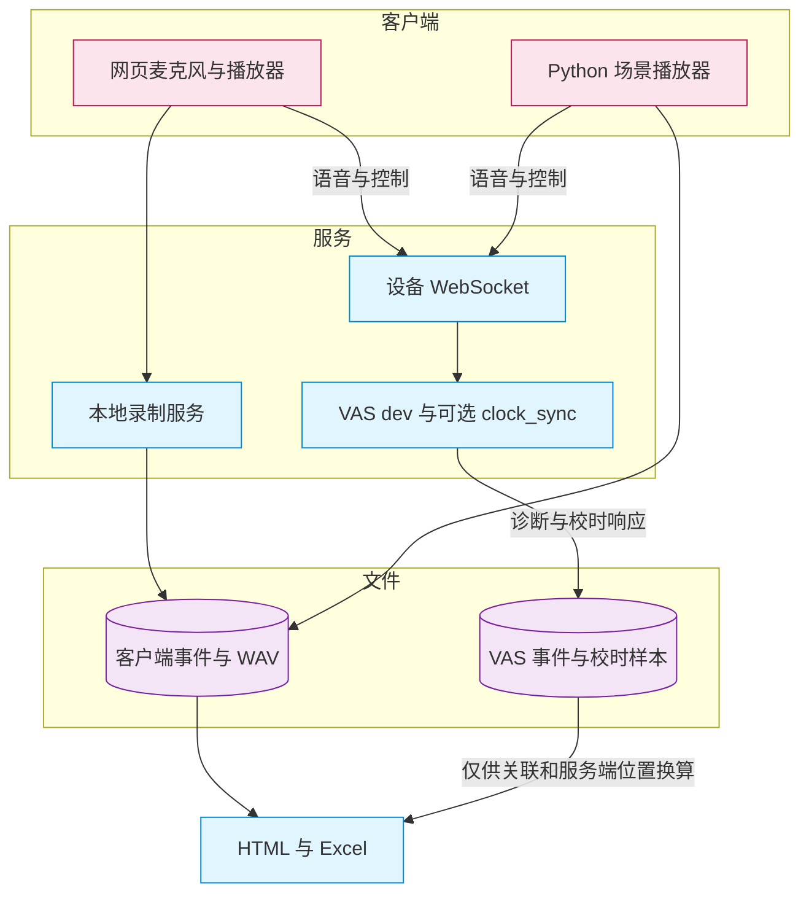

# 客户端录制与 VAS 校时架构

```mermaid
flowchart TB
    subgraph 客户端
        Browser[网页麦克风与播放器]:::client
        Python[Python 场景播放器]:::client
    end
    subgraph 服务
        WS[设备 WebSocket]:::core
        VAS[VAS dev 与可选 clock_sync]:::core
        Capture[本地录制服务]:::core
    end
    subgraph 文件
        Client[(客户端事件与 WAV)]:::storage
        Trace[(VAS 事件与校时样本)]:::storage
    end
    Browser -->|语音与控制| WS
    Python -->|语音与控制| WS
    WS --> VAS
    Browser --> Capture --> Client
    Python --> Client
    VAS -->|诊断与校时响应| Trace
    Client --> Report[HTML 与 Excel]:::core
    Trace -->|仅供关联和服务端位置换算| Report

    classDef core fill:#e1f5fe,stroke:#0288d1;
    classDef storage fill:#f3e5f5,stroke:#7b1fa2;
    classDef client fill:#fce4ec,stroke:#c2185b;
```
