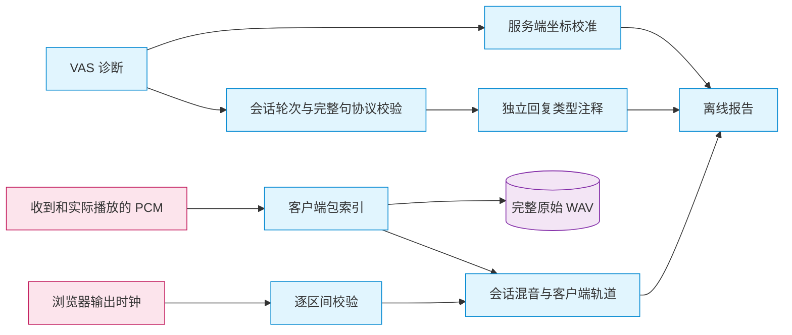

# 客户端事实与服务端关联分离

```mermaid
flowchart LR
    PCM[收到和实际播放的 PCM]:::client --> Index[客户端包索引]:::core
    Clock[浏览器输出时钟]:::client --> Validate[逐区间校验]:::core
    Index --> Mix[会话混音与客户端轨道]:::core
    Validate --> Mix
    Index --> Original[(完整原始 WAV)]:::storage
    Server[VAS 诊断]:::core --> Evidence[会话轮次与完整句协议校验]:::core
    Evidence --> Annotation[独立回复类型注释]:::core
    Server --> Offset[服务端坐标校准]:::core
    Mix --> Report[离线报告]:::core
    Annotation --> Report
    Offset --> Report

    classDef core fill:#e1f5fe,stroke:#0288d1;
    classDef storage fill:#f3e5f5,stroke:#7b1fa2;
    classDef client fill:#fce4ec,stroke:#c2185b;
```
