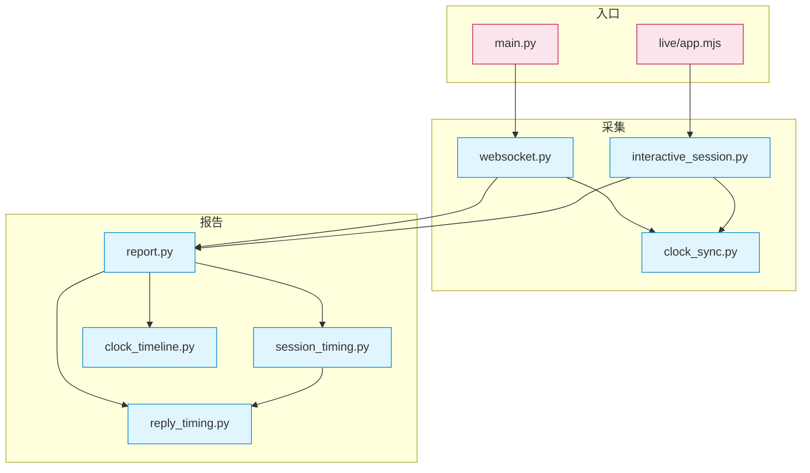

# 模块职责

```mermaid
flowchart TB
    subgraph 入口
        CLI[main.py]:::client
        Web[live/app.mjs]:::client
    end
    subgraph 采集
        Transport[websocket.py]:::core
        Capture[interactive_session.py]:::core
        Sync[clock_sync.py]:::core
    end
    subgraph 报告
        Evaluate[report.py]:::core
        Timing[reply_timing.py]:::core
        Session[session_timing.py]:::core
        Projection[clock_timeline.py]:::core
    end
    CLI --> Transport --> Sync
    Web --> Capture --> Sync
    Transport --> Evaluate
    Capture --> Evaluate
    Evaluate --> Timing
    Evaluate --> Session
    Session --> Timing
    Evaluate --> Projection

    classDef core fill:#e1f5fe,stroke:#0288d1;
    classDef storage fill:#f3e5f5,stroke:#7b1fa2;
    classDef client fill:#fce4ec,stroke:#c2185b;
```
