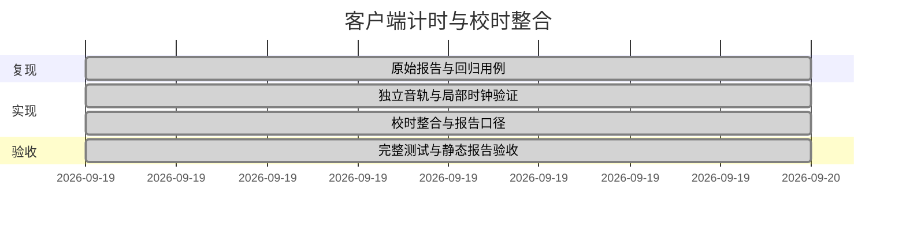

# 交付顺序

```mermaid
gantt
    title 客户端计时与校时整合
    dateFormat YYYY-MM-DD
    section 复现
    原始报告与回归用例 :done, red, 2026-09-19, 1d
    section 实现
    独立音轨与局部时钟验证 :done, fix, 2026-09-19, 1d
    校时整合与报告口径 :done, sync, 2026-09-19, 1d
    section 验收
    完整测试与静态报告验收 :done, verify, 2026-09-19, 1d
```
