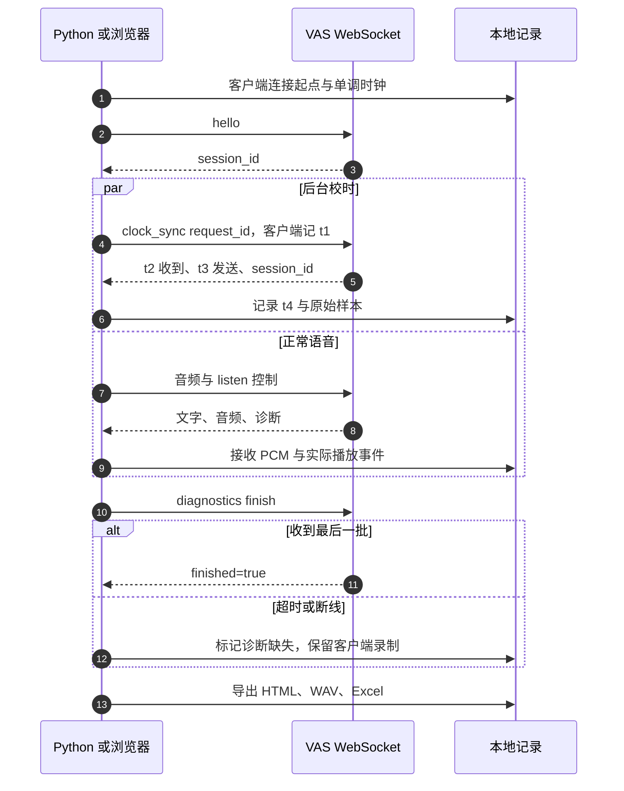
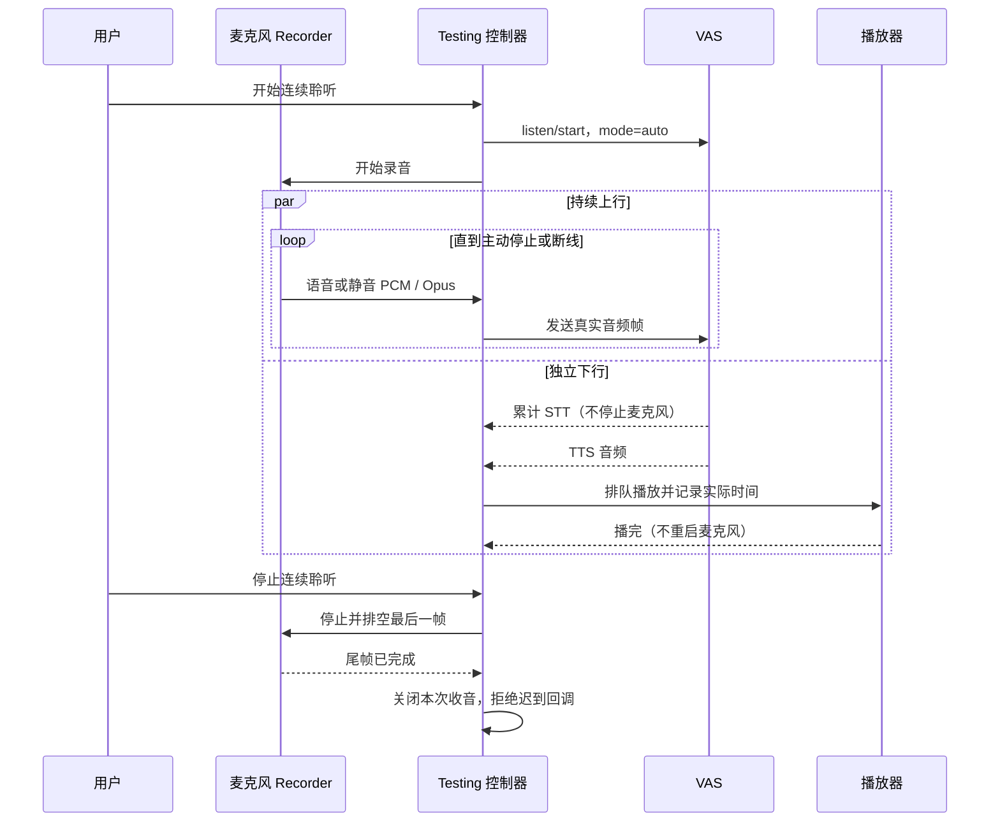

# 可选校时与正常对话

```mermaid
sequenceDiagram
    autonumber
    participant C as Python 或浏览器
    participant V as VAS WebSocket
    participant R as 本地记录
    C->>R: 客户端连接起点与单调时钟
    C->>V: hello
    V-->>C: session_id
    par 后台校时
        C->>V: clock_sync request_id，客户端记 t1
        V-->>C: t2 收到、t3 发送、session_id
        C->>R: 记录 t4 与原始样本
    and 正常语音
        C->>V: 音频与 listen 控制
        V-->>C: 文字、音频、诊断
        C->>R: 接收 PCM 与实际播放事件
    end
    C->>V: diagnostics finish
    alt 收到最后一批
        V-->>C: finished=true
    else 超时或断线
        C->>R: 标记诊断缺失，保留客户端录制
    end
    C->>R: 导出 HTML、WAV、Excel
```

## 网页 VAD 收音与播放独立

```mermaid
sequenceDiagram
    participant U as 用户
    participant M as 麦克风 Recorder
    participant C as Testing 控制器
    participant V as VAS
    participant P as 播放器
    U->>C: 开始连续聆听
    C->>V: listen/start，mode=auto
    C->>M: 开始录音
    par 持续上行
        loop 直到主动停止或断线
            M->>C: 语音或静音 PCM / Opus
            C->>V: 发送真实音频帧
        end
    and 独立下行
        V-->>C: 累计 STT（不停止麦克风）
        V-->>C: TTS 音频
        C->>P: 排队播放并记录实际时间
        P-->>C: 播完（不重启麦克风）
    end
    U->>C: 停止连续聆听
    C->>M: 停止并排空最后一帧
    M-->>C: 尾帧已完成
    C->>C: 关闭本次收音，拒绝迟到回调
```
