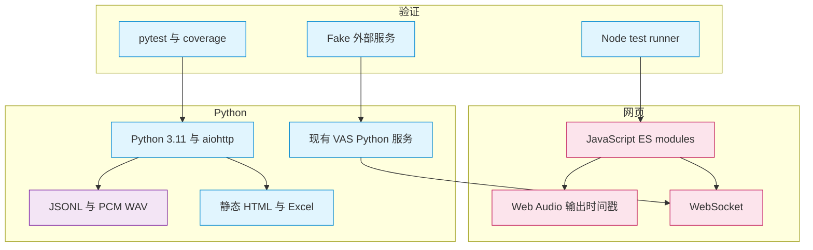

# 本次功能使用的技术

```mermaid
flowchart TB
    subgraph 网页
        Web[JavaScript ES modules]:::client --> Audio[Web Audio 输出时间戳]:::client
        Web --> WS[WebSocket]:::client
    end
    subgraph Python
        Client[Python 3.11 与 aiohttp]:::core --> Data[JSONL 与 PCM WAV]:::storage
        VAS[现有 VAS Python 服务]:::core --> WS
        Client --> Report[静态 HTML 与 Excel]:::core
    end
    subgraph 验证
        Pytest[pytest 与 coverage]:::core --> Client
        Node[Node test runner]:::core --> Web
        Fake[Fake 外部服务]:::core --> VAS
    end

    classDef core fill:#e1f5fe,stroke:#0288d1;
    classDef storage fill:#f3e5f5,stroke:#7b1fa2;
    classDef client fill:#fce4ec,stroke:#c2185b;
```
